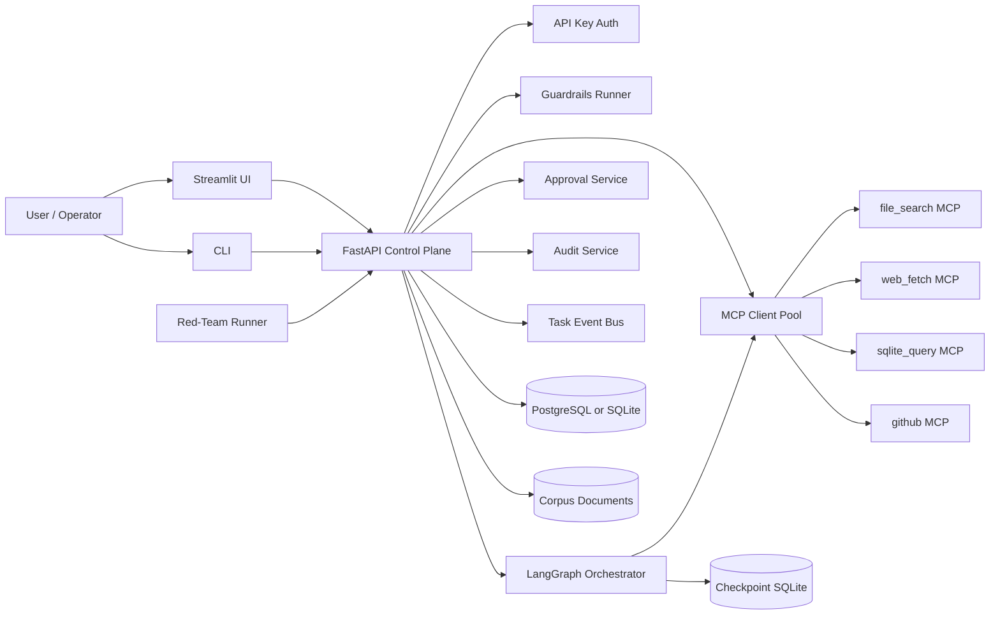
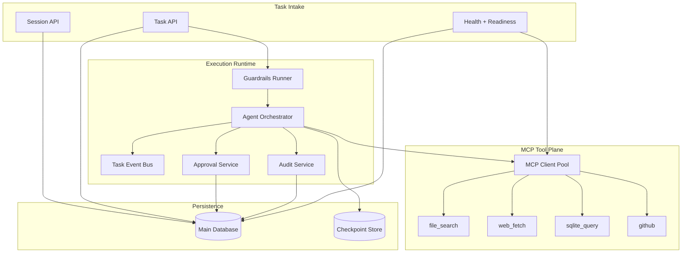
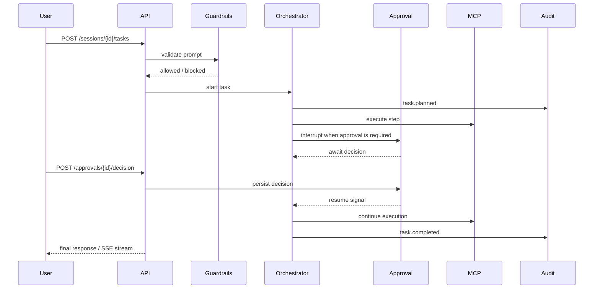
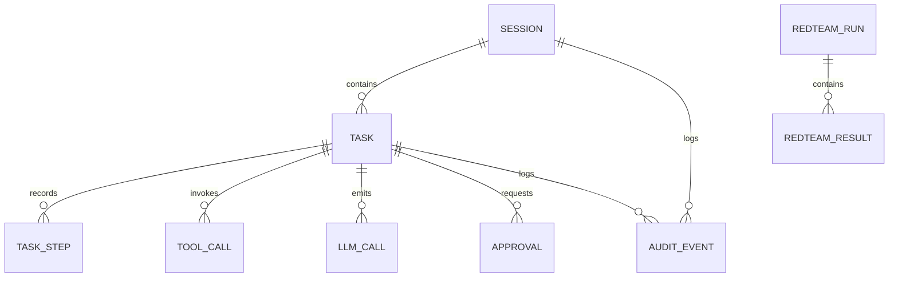
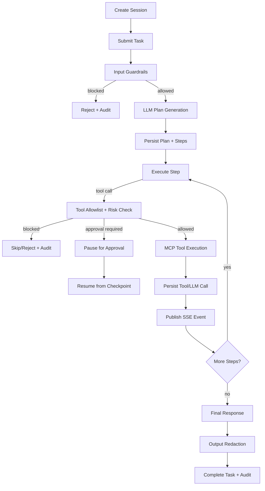
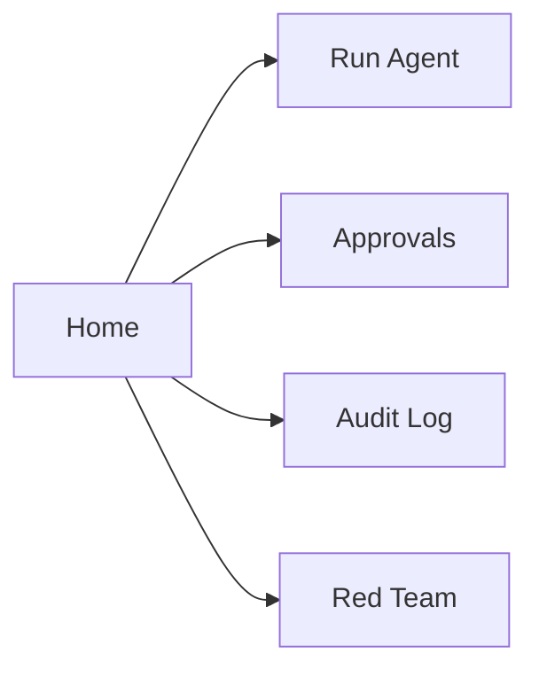

# AgentForge

### Multi-Tool Agent Platform with MCP, NeMo Guardrails, Human Approval, and Tamper-Evident Audit Logging

[](https://github.com/Mehulupase01/AgentForge-Multi-Tool-Agent-with-MCP--NeMo-Guardrails---Audit-Logging/actions/workflows/ci.yml)
[](https://github.com/Mehulupase01/AgentForge-Multi-Tool-Agent-with-MCP--NeMo-Guardrails---Audit-Logging/actions/workflows/redteam.yml)
[](https://www.python.org/)
[](https://fastapi.tiangolo.com/)
[](https://langchain-ai.github.io/langgraph/)
[](https://modelcontextprotocol.io/)
[](https://github.com/NVIDIA/NeMo-Guardrails)
[](https://streamlit.io/)
[](https://openrouter.ai/)
[](LICENSE)

AgentForge is a production-structured agent platform where an LLM can plan work, call tools through MCP sidecars, pause risky actions for human approval, and leave behind a tamper-evident audit trail that can be verified after the fact.

This is not a toy chatbot repo. It is a full control plane for enterprise-style agent execution with:

- a FastAPI API for sessions, tasks, approvals, corpus operations, MCP introspection, audit verification, and red-team runs
- a LangGraph orchestrator with persisted checkpoints and resumable execution
- deterministic NeMo Guardrails plus PII redaction and tool allowlisting
- four MCP tool servers for file search, web fetch, SQLite querying, and GitHub access
- a Streamlit operator UI and a standalone CLI
- red-team persistence and CI-backed safety gating

---

## Table of Contents

- [Short Abstract](#short-abstract)
- [Deep Introduction](#deep-introduction)
- [Platform Snapshot](#platform-snapshot)
- [V2 At A Glance](#v2-at-a-glance)
- [What Makes This Different](#what-makes-this-different)
- [System Architecture](#system-architecture)
- [Architecture Deep Dive](#architecture-deep-dive)
- [Request Lifecycle](#request-lifecycle)
- [Safety and Control Model](#safety-and-control-model)
- [MCP Tool Plane](#mcp-tool-plane)
- [Persisted Data Model](#persisted-data-model)
- [Public Interfaces](#public-interfaces)
- [API Examples](#api-examples)
- [Operator Surfaces](#operator-surfaces)
- [UI Walkthrough](#ui-walkthrough)
- [Evaluation and Verification](#evaluation-and-verification)
- [Detailed Local Run Guide](#detailed-local-run-guide)
- [V2 Quickstart](#v2-quickstart)
- [Repository Layout](#repository-layout)
- [Deployment Notes](#deployment-notes)
- [Known Local Waivers](#known-local-waivers)
- [References](#references)

---

## Short Abstract

Most agent demos can answer a prompt. Far fewer can answer operational questions like:

- What tool did the agent call?
- Why was that tool allowed?
- What exactly got blocked by safety policy?
- Could a human intervene before the action executed?
- Can we prove the audit trail was not tampered with?

AgentForge is built around those questions.

The platform accepts a user prompt through a FastAPI control plane, evaluates it with deterministic guardrails, plans execution with an LLM, routes tool calls through dedicated MCP sidecars, pauses risky actions for approval, and records key events into an append-only SHA-256 integrity chain. Operators can monitor and drive the system through HTTP APIs, a Streamlit UI, or a CLI. A persisted red-team runner continuously probes the safety layer and can act as a release gate in CI.

---

## Deep Introduction

The easiest way to understand this repository is to think of it as an agent runtime that has been split into explicit, inspectable subsystems instead of hidden inside one giant prompt loop.

In a lightweight demo, the model receives a prompt, decides what to do, maybe calls a tool, and returns an answer. That is often fine for exploration, but it becomes difficult to operate safely the moment the agent can reach real systems. You need to know which tools exist, what inputs they saw, whether risky actions were blocked, whether the agent paused for approval, and whether the logs can be trusted after an incident.

AgentForge treats those concerns as first-class product requirements.

At runtime, the system creates a session, accepts a task, and runs deterministic input checks before orchestration begins. The orchestrator then asks the configured LLM to generate a plan. Each plan step is persisted. If a step is a tool call, the request is validated against a deny-by-default tool allowlist. Medium-risk and high-risk actions can trigger approval interrupts. Execution state is checkpointed so the task can resume after a human decision. Every major event is written into an append-only audit chain where each event hash depends on the previous event, making integrity verification possible later.

The result is a system that is useful both for building agents and for governing them.

This repository also deliberately separates local workstation constraints from release quality. The maintainer's Windows machine had Docker Desktop and Bitdefender interference during development, so the Docker verification path was explicitly waived locally. Host-side verification, GitHub Actions CI, and the persisted red-team workflow were used instead to bring the repository to a clean release state.

---

## Platform Snapshot

| Area | What is included | Why it matters |
| --- | --- | --- |
| Control plane | FastAPI API, typed schemas, health/readiness endpoints, API-key auth | Gives the system an explicit and automatable boundary instead of a hidden prompt loop |
| Orchestration | LangGraph planner/executor, persisted checkpoints, resumable task graph | Makes long-running and approval-paused work recoverable |
| Tooling | Four MCP sidecars: `file_search`, `web_fetch`, `sqlite_query`, `github` | Keeps tool execution isolated, inspectable, and extensible |
| Safety | NeMo Guardrails, prompt-injection checks, PII redaction, tool allowlist, risk classification | Turns safety behavior into deterministic policy instead of vague prompting |
| Governance | Append-only audit chain, approval decisions, integrity verification endpoints | Supports compliance, investigation, and post-run trust |
| Operator UX | Streamlit console, CLI client, HTTP-first API | Makes the platform usable by operators as well as developers |
| Evaluation | Persisted redteam runs, CI-backed gating, scenario scoring | Prevents safety drift from being invisible between releases |

---

## V2 At A Glance

The `Multi-Agent-Orchestration` branch upgrades AgentForge from a single-orchestrator runtime into a supervised multi-agent system with durable recovery and operator telemetry.

| v2 addition | What changed | Why it matters |
| --- | --- | --- |
| Supervisor graph | Six roles: `orchestrator`, `analyst`, `researcher`, `engineer`, `secretary`, `security_officer` | Tasks can be decomposed and routed intentionally instead of forcing one agent persona to do everything |
| Self-healing | Deterministic reflect-and-retry flow with bounded escalation | Transient tool or model failures do not automatically become dead tasks |
| Replay | Idempotent task replay with cached-step skipping | Crashed or interrupted runs can be resumed without blindly re-executing side effects |
| Skills | YAML skill registry with a closed 5-key policy schema | Tool usage is packaged, reviewable, reloadable, and policy-bound |
| Security Officer | Second-line review agent for risky plans, tool calls, and long outputs | High-risk work is reviewed by a specialist layer on top of base guardrails |
| Triggers | Webhook and schedule driven task creation plus `trigger_worker` | The platform can proactively create work from external events instead of waiting for manual task submission |
| AgentOps | Cost tracking, confidence scoring, handoff analytics, Streamlit dashboard | Operators can see whether the multi-agent runtime is reliable, cheap, and trustworthy |
| v2 safety gate | Separate v2 redteam suite with 20 multi-agent scenarios | Release confidence stays measurable even as the system gets more capable |

---

## What Makes This Different

### 1. It is an agent control plane, not just a prompt wrapper

The API exposes 25 route handlers across health, sessions, tasks, approvals, audit, corpus, MCP introspection, and red-team operations. The system persists sessions, tasks, steps, tool calls, LLM calls, approval decisions, audit events, corpus documents, and red-team results.

### 2. Tooling is isolated behind MCP sidecars

Instead of wiring tool logic directly into the main API process, AgentForge pushes tools into four dedicated MCP servers:

- `file_search`
- `web_fetch`
- `sqlite_query`
- `github`

That makes the tool surface explicit and introspectable and keeps the control plane cleaner.

### 3. Guardrails are deterministic and auditable

The safety layer is not just "hope the model behaves." It combines prompt-injection screening, PII redaction, tool allowlisting, risk classification, approval gates, and audit events so blocked behavior is visible and testable.

### 4. Approval is built into the execution graph

Approval is not bolted on afterward. The LangGraph runtime persists state and can interrupt execution, wait for a reviewer decision, and resume the same task deterministically from a checkpoint.

### 5. Red-teaming is part of the product

The repository includes a persisted red-team runner, 50 adversarial scenarios, JUnit reporting, and a GitHub Actions workflow that can enforce a safety threshold.

### 6. Operator UX is included

This repo ships both a Streamlit operator UI and a CLI. It is designed to be used, not only imported.

---

## System Architecture



### Major runtime pieces

| Component | Role |
| --- | --- |
| `apps/api` | Main control plane. Hosts the HTTP API, orchestrator wiring, guardrails integration, approvals, audit, corpus operations, and red-team services. |
| `apps/mcp_servers/file_search` | Search and document-read tools over the local markdown corpus. |
| `apps/mcp_servers/web_fetch` | Controlled web retrieval tool surface. |
| `apps/mcp_servers/sqlite_query` | Read-only query server for the synthetic SQLite fixture database. |
| `apps/mcp_servers/github` | Read-only GitHub tool server backed by a scoped token. |
| `apps/ui` | Streamlit-based operator interface. |
| `apps/cli` | Command-line operator client. |

---

## Architecture Deep Dive

### Control-plane execution map



### Approval-resume sequence



### Data relationships at a glance



These diagrams correspond directly to the actual module split in `apps/api/src/agentforge/`:

- `routers/` defines the HTTP boundary
- `services/` implements orchestration, approvals, audit, redteam, provider integration, and MCP pooling
- `models/` persists the session, task, tool, approval, audit, and redteam lifecycle
- `guardrails/` enforces deterministic safety policy around prompts, outputs, and tools

---

## Request Lifecycle



### What happens in practice

1. A client creates a session.
2. A user prompt is submitted as a task.
3. Input guardrails evaluate the request before orchestration.
4. The LLM generates a structured plan.
5. Each step is executed in sequence.
6. Tool calls are validated against the allowlist and risk rules.
7. If approval is required, the graph interrupts and waits.
8. Execution resumes after approval using a persisted checkpoint.
9. Final output is redacted if needed.
10. The task is completed and the audit chain is extended.

---

## Safety and Control Model

AgentForge's safety model is layered rather than singular.

### Input safety

- prompt-injection screening
- disallowed request detection
- deterministic rejection path with audit records

### Tool safety

- deny-by-default allowlist
- server and tool pair validation
- risk classification before execution
- approval gate for risky actions

### Output safety

- Presidio-based PII redaction
- structured entity replacements
- output returned only after redaction pass

### Human control

- `awaiting_approval` task state
- persisted approval records
- resumable execution through LangGraph checkpoints

### Audit integrity

- append-only event model
- SHA-256 hash chain
- integrity verification endpoint
- tamper detection tested in the suite

---

## MCP Tool Plane

The MCP layer is one of the core architectural decisions in this project.

### Why MCP is used here

MCP makes the tool surface explicit. The API can ask:

- which tool servers are reachable?
- which tools does each server expose?
- are all sidecars healthy?

This becomes part of readiness and operations instead of hidden application code.

### Included MCP servers

| MCP Server | Purpose | Typical Use |
| --- | --- | --- |
| `file_search` | Searches and reads the local markdown corpus | Find documents about a concept, then retrieve exact passages |
| `web_fetch` | Fetches web content through a controlled interface | Pull external reference content when allowed |
| `sqlite_query` | Runs read-only SQL against the synthetic fixture database | Structured retrieval over tabular data |
| `github` | Uses a scoped token for GitHub lookups | Read repository metadata or inspect GitHub context |

### API introspection endpoints

- `GET /api/v1/mcp/servers`
- `GET /api/v1/mcp/servers/{server_name}/tools`

---

## Persisted Data Model

The repository defines 10 main persisted model modules in the API service.

| Model | Purpose |
| --- | --- |
| `Session` | Top-level conversation/execution container |
| `Task` | Individual user request lifecycle |
| `TaskStep` | Persisted step-by-step execution trail |
| `ToolCall` | Recorded tool call inputs and outputs |
| `LLMCall` | Recorded model invocations and token usage metadata |
| `Approval` | Human decision records for risky actions |
| `AuditEvent` | Append-only audit chain event |
| `CorpusDocument` | Ingested markdown corpus metadata |
| `RedteamRun` | A persisted red-team execution |
| `RedteamResult` | Per-scenario outcome and diagnostics |

This model split is what makes the platform explainable after execution. You can inspect what happened without reverse-engineering a prompt transcript.

---

## Public Interfaces

### API surface summary

| Domain | Primary endpoints | Typical operator outcome |
| --- | --- | --- |
| Health | `GET /api/v1/health/liveness`, `GET /api/v1/health/readiness` | Confirms the API, database, and MCP dependencies are up |
| Sessions | `POST /api/v1/sessions`, `GET /api/v1/sessions`, `GET /api/v1/sessions/{session_id}` | Creates and inspects agent work containers |
| Tasks | `POST /api/v1/sessions/{session_id}/tasks`, `GET /api/v1/tasks/{task_id}`, `GET /api/v1/tasks/{task_id}/stream`, `POST /api/v1/tasks/{task_id}/resume` | Starts agent work, watches streaming progress, resumes paused runs |
| Approvals | `GET /api/v1/approvals`, `GET /api/v1/approvals/{approval_id}`, `POST /api/v1/approvals/{approval_id}/decision` | Reviews and resolves risky actions |
| Audit | `GET /api/v1/audit/events`, `GET /api/v1/audit/sessions/{session_id}/events`, `GET /api/v1/audit/integrity` | Investigates behavior and verifies tamper-evidence |
| Corpus | `POST /api/v1/corpus/reindex`, `GET /api/v1/corpus/documents` | Refreshes and inspects the searchable knowledge base |
| MCP | `GET /api/v1/mcp/servers`, `GET /api/v1/mcp/servers/{server_name}/tools` | Confirms tool-server health and exposed tool metadata |
| Redteam | `POST /api/v1/redteam/run`, `GET /api/v1/redteam/runs`, `GET /api/v1/redteam/runs/{run_id}`, `GET /api/v1/redteam/runs/{run_id}/results` | Evaluates safety posture and release readiness |

### Health and readiness

- `GET /api/v1/health/liveness`
- `GET /api/v1/health/readiness`

### Session APIs

- `POST /api/v1/sessions`
- `GET /api/v1/sessions`
- `GET /api/v1/sessions/{session_id}`
- `POST /api/v1/sessions/{session_id}/end`

### Task APIs

- `POST /api/v1/sessions/{session_id}/tasks`
- `GET /api/v1/tasks/{task_id}`
- `GET /api/v1/tasks/{task_id}/steps`
- `GET /api/v1/tasks/{task_id}/stream`
- `POST /api/v1/tasks/{task_id}/resume`

### Approval APIs

- `GET /api/v1/approvals`
- `GET /api/v1/approvals/{approval_id}`
- `POST /api/v1/approvals/{approval_id}/decision`

### Audit APIs

- `GET /api/v1/audit/events`
- `GET /api/v1/audit/sessions/{session_id}/events`
- `GET /api/v1/audit/integrity`

### Corpus APIs

- `POST /api/v1/corpus/reindex`
- `GET /api/v1/corpus/documents`

### MCP APIs

- `GET /api/v1/mcp/servers`
- `GET /api/v1/mcp/servers/{server_name}/tools`

### Red-team APIs

- `POST /api/v1/redteam/run`
- `GET /api/v1/redteam/runs`
- `GET /api/v1/redteam/runs/{run_id}`
- `GET /api/v1/redteam/runs/{run_id}/results`

---

## API Examples

The examples below are representative of the actual schema objects defined in `apps/api/src/agentforge/schemas/`.

### 1. Create a session

```bash
curl -X POST http://localhost:8015/api/v1/sessions \
  -H "Content-Type: application/json" \
  -H "X-API-Key: dev-key" \
  -d '{"metadata":{"source":"readme-example"}}'
```

```json
{
  "id": "7c1b9d8c-3b32-4d2d-8d84-a5d70228f0fb",
  "user_id": "system",
  "status": "active",
  "started_at": "2026-04-20T16:00:00Z",
  "ended_at": null,
  "metadata": {
    "source": "readme-example"
  },
  "task_count": 0,
  "tool_call_count": 0,
  "approval_count": 0
}
```

### 2. Submit a task

```bash
curl -X POST http://localhost:8015/api/v1/sessions/7c1b9d8c-3b32-4d2d-8d84-a5d70228f0fb/tasks \
  -H "Content-Type: application/json" \
  -H "X-API-Key: dev-key" \
  -d '{"user_prompt":"Find transformer content and summarize it."}'
```

```json
{
  "id": "4bf22d77-3815-4e7f-9af2-763ec0286b75",
  "session_id": "7c1b9d8c-3b32-4d2d-8d84-a5d70228f0fb",
  "user_prompt": "Find transformer content and summarize it.",
  "plan": null,
  "status": "queued",
  "started_at": null,
  "completed_at": null,
  "final_response": null,
  "error": null,
  "checkpoint_id": null
}
```

### 3. Inspect MCP server state

```bash
curl http://localhost:8015/api/v1/mcp/servers \
  -H "X-API-Key: dev-key"
```

```json
[
  {
    "name": "file_search",
    "url": "http://localhost:8101/mcp",
    "status": "ok",
    "tool_count": 2,
    "server_label": "file-search-mcp"
  },
  {
    "name": "github",
    "url": "http://localhost:8104/mcp",
    "status": "ok",
    "tool_count": 2,
    "server_label": "github-mcp"
  }
]
```

### 4. Approve a risky action

```bash
curl -X POST http://localhost:8015/api/v1/approvals/9d24fc4e-6a97-49e0-84d5-3d0c2f426c50/decision \
  -H "Content-Type: application/json" \
  -H "X-API-Key: dev-key" \
  -d '{"decision":"approved","rationale":"Reviewed by operator"}'
```

```json
{
  "id": "9d24fc4e-6a97-49e0-84d5-3d0c2f426c50",
  "task_id": "4bf22d77-3815-4e7f-9af2-763ec0286b75",
  "task_step_id": "89cddbc1-0c46-41bf-9322-0a1264f5f850",
  "risk_level": "high",
  "risk_reason": "tool call touched a guarded capability",
  "action_summary": "Allow sqlite_query.query_database against the synthetic fixture",
  "requested_at": "2026-04-20T16:02:00Z",
  "decided_at": "2026-04-20T16:03:12Z",
  "decided_by": "operator",
  "decision": "approved",
  "rationale": "Reviewed by operator"
}
```

### 5. Verify audit integrity

```bash
curl http://localhost:8015/api/v1/audit/integrity \
  -H "X-API-Key: dev-key"
```

```json
{
  "verified": true,
  "events_checked": 128,
  "first_broken_sequence": null,
  "expected_chain_hash": null,
  "actual_chain_hash": null
}
```

### 6. Stream a task over SSE

The task stream is consumed by both the UI and CLI:

```text
event: plan
data: {"steps":[{"step_id":"step-1","type":"tool_call","description":"Search the corpus","server":"file_search","tool":"search_documents","args":{"query":"transformer"}}]}

event: step
data: {"ordinal":1,"status":"completed","description":"Search the corpus"}

event: task_completed
data: {"final_response":"Transformers replace recurrence with attention..."}
```

---

## Operator Surfaces

### CLI

The standalone CLI supports the core operator flow:

- `agentforge session new`
- `agentforge task run "<prompt>"`
- `agentforge approval list`
- `agentforge approval approve <approval_id>`
- `agentforge audit verify`

The CLI also includes SSE parsing logic so operators can watch task execution as a stream instead of polling.

### Streamlit UI

The Streamlit app acts as an operator console for:

- session/task creation
- approval review
- audit inspection
- general control-plane visibility

The current Streamlit surface is organized into one home view plus four dedicated pages:

- `app.py`
  - readiness snapshot
  - recent sessions table
  - navigation guidance
- `pages/1_Run_Agent.py`
  - submit prompts
  - stream task events
  - inspect final responses
- `pages/2_Approvals.py`
  - list pending approvals
  - approve or reject risky actions
- `pages/3_Audit_Log.py`
  - browse audit events
  - inspect integrity results
- `pages/4_Red_Team.py`
  - trigger red-team runs
  - inspect run summaries and results

### API-first operation

Everything the UI and CLI do ultimately maps back to the HTTP API, so the system remains automatable for external tools or future frontends.

---

## UI Walkthrough

This repository does not currently ship screenshot assets in Git, so this section serves as a grounded walkthrough of the real UI surface instead of a mock marketing gallery.

### Navigation map



### Home page

The home page acts as the operator dashboard:

- control-plane title and framing
- readiness JSON panel
- recent sessions table
- sidebar hints for the main workflows

Conceptually it looks like this:

```text
+---------------------------------------------------------------+
| AgentForge Control Plane                                      |
| Operator view for health, sessions, approvals, audit, safety  |
+-----------------------------+---------------------------------+
| Readiness                   | Recent Sessions                 |
| { status, database, mcp }   | session_id | status | tasks...  |
|                             | ...                             |
+-----------------------------+---------------------------------+
| Sidebar pages: Run Agent | Approvals | Audit Log | Red Team   |
+---------------------------------------------------------------+
```

### Run Agent page

This is the main operational page for daily usage:

- create a new task
- reuse an existing session when needed
- watch live SSE events
- inspect the final response

It is effectively the human-facing window into the orchestrator, task event bus, and tool execution lifecycle.

### Approvals page

This page is the human checkpoint:

- review pending approvals
- inspect risk level and action summary
- approve or reject the blocked action

It maps directly to the approval service and task resume flow.

### Audit Log page

This page exposes the governance story:

- list audit events
- inspect event payloads and hash-chain state
- verify integrity from the UI

### Red Team page

This page is the safety operations surface:

- trigger a red-team run
- inspect run metadata
- review scenario outcomes and safety posture

### Why the UI matters

The UI is not just a cosmetic layer. Each page corresponds to a concrete subsystem:

- `Run Agent` -> task intake, streaming, orchestration
- `Approvals` -> human-in-the-loop control
- `Audit Log` -> integrity and compliance visibility
- `Red Team` -> safety evaluation and release confidence

---

## Evaluation and Verification

This repository has already been brought through a full phase-by-phase implementation and release pass. The current project state includes:

- 25 API route handlers
- 4 MCP sidecar services
- 50 persisted red-team scenarios
- 53 synthetic corpus documents plus a corpus README
- 62 test functions across API, sidecar, and UI import coverage

### Important verified outcomes

- audit chain integrity verification works
- prompt injection and unsafe requests can be blocked before execution
- risky tool calls can pause for approval and resume later
- SSE task streaming works across both UI and CLI parsers
- MCP sidecar metadata and readiness are surfaced through the API
- the GitHub Actions `ci` workflow and scheduled `redteam` workflow are wired as release gates

### CI/CD status

GitHub Actions provides two main automation lanes:

- `ci.yml`
  - lint
  - API tests
  - MCP sidecar tests
  - image build checks
  - delegated redteam workflow call
- `redteam.yml`
  - environment sync
  - spaCy model install
  - optional live OpenRouter-backed redteam gate
  - deterministic pytest safety suite
  - report artifact upload

The redteam workflow is intentionally adaptive:

- if `OPENROUTER_API_KEY` exists in repository secrets, the live `agentforge redteam-run` gate executes
- if it does not exist, the deterministic pytest safety suite still runs so the safety workflow remains usable in public CI

---

## Detailed Local Run Guide

### 1. Create local environment

```powershell
copy .env.example .env
```

Fill in at least:

```env
OPENROUTER_API_KEY=your_key_here
OPENROUTER_MODEL=openrouter/free
GITHUB_TOKEN=your_scoped_token_here
TRIGGER_WORKER_INTERNAL_API_KEY=dev-key-change-me
```

### 2. Sync the API environment

```powershell
uv sync --directory apps/api
uv pip install --python .venv\Scripts\python.exe https://github.com/explosion/spacy-models/releases/download/en_core_web_sm-3.7.1/en_core_web_sm-3.7.1-py3-none-any.whl
```

### 3. Initialize the database

```powershell
uv run --directory apps/api alembic upgrade head
```

### 4. Generate and ingest local knowledge fixtures

```powershell
uv run --directory apps/api python -m agentforge.tools.generate_corpus
uv run --directory apps/api agentforge seed-synthetic --output fixtures/synthetic.sqlite
uv run --directory apps/api agentforge ingest-corpus
```

### 5. Run the test suite

```powershell
uv run --directory apps/api pytest tests -q
uv run --directory apps/api pytest tests/safety/test_redteam_suite.py -q
uv run --directory apps/api pytest tests/safety/test_redteam_v2.py -q
```

### 6. Run the API

```powershell
uv run --directory apps/api uvicorn agentforge.main:app --app-dir src --host 0.0.0.0 --port 8015
```

### 7. Use the CLI

```powershell
uv run --directory apps/cli agentforge session new
uv run --directory apps/cli agentforge task run "Find transformer content and summarize it."
uv run --directory apps/cli agentforge approval list
uv run --directory apps/cli agentforge audit verify
```

### 8. Run the trigger worker

```powershell
uv run --directory apps/trigger_worker uvicorn trigger_worker.server:app --app-dir src --host 0.0.0.0 --port 8105
```

### 9. Run the red-team CLI manually

```powershell
uv run --directory apps/api agentforge redteam-run
uv run --directory apps/api agentforge redteam-run --suite v2
```

---

## V2 Quickstart

If you want to exercise the multi-agent branch specifically, this is the shortest high-signal path:

1. Apply the v2 database head.
   `uv run --directory apps/api alembic upgrade head`
2. Start the API and trigger worker in two terminals.
   `uv run --directory apps/api uvicorn agentforge.main:app --app-dir src --host 0.0.0.0 --port 8000`
   `uv run --directory apps/trigger_worker uvicorn trigger_worker.server:app --app-dir src --host 0.0.0.0 --port 8105`
3. Start the Streamlit UI.
   `uv run --directory apps/ui streamlit run src/agentforge_ui/Home.py`
4. Create a task that requires planning and synthesis.
   Example: `Summarize the latest relevant corpus guidance, propose an implementation plan, and identify any security review points.`
5. Watch the task stream or the AgentOps page.
   You should see handoffs, retries when applicable, review decisions, cost updates, and confidence scoring.
6. Exercise replay.
   `uv run --directory apps/api agentforge task-replay <task-id>`
7. Exercise both safety gates before calling the branch release-ready.
   `uv run --directory apps/api pytest tests/safety/test_redteam_suite.py tests/safety/test_redteam_v2.py -v`

---

## Repository Layout

```text
apps/
  api/
    alembic/
    src/agentforge/
      guardrails/
      models/
      routers/
      schemas/
      services/
      tools/
    tests/
  cli/
    src/agentforge_cli/
  trigger_worker/
    src/trigger_worker/
  ui/
    src/agentforge_ui/
    tests/
  mcp_servers/
    file_search/
    web_fetch/
    sqlite_query/
    github/
fixtures/
  corpus/
ops/
  docker/
  github/
.github/
  workflows/
docker-compose.yml
pyproject.toml
uv.lock
```

### Workspace layout

The root `uv` workspace includes:

- `agentforge-api`
- `agentforge-cli`
- `agentforge-ui`
- `agentforge-trigger-worker`
- `file-search-mcp`
- `web-fetch-mcp`
- `sqlite-query-mcp`
- `github-mcp`

---

## Deployment Notes

The repo includes a full Compose layout for the intended release path:

- `ops/docker/compose.full.yml`
- `ops/docker/compose.sidecars.yml`
- `docker-compose.yml`

The intended full stack includes:

- API
- database
- all four MCP sidecars
- Streamlit UI

### Deployment modes

| Mode | Components | Best for | Notes |
| --- | --- | --- | --- |
| Local API-only | API + local SQLite/checkpoints + optional locally spawned MCP processes | Fast iteration on routers, schemas, and orchestration logic | Lowest friction on constrained Windows machines |
| Local host full-stack | API, local DB, sidecars, UI, CLI, corpus fixtures | End-to-end operator testing without containers | Sensitive to local security software and port/process interference |
| Docker Compose | `docker-compose.yml` or `ops/docker/compose.full.yml` with DB, API, MCP sidecars, UI | Repeatable full-stack runs and release-like verification | Preferred when Docker Desktop is healthy |
| GitHub Actions CI | Lint, API tests, MCP test matrix, image builds, redteam gate | Release truth and regression prevention | Current green CI status is the strongest verification source for this repo |
| Hardened production | Managed secrets, managed Postgres, TLS termination, observability, protected branches | Real operator deployment | Requires stronger auth, backups, alerting, and environment-specific secret handling |

For production hardening, the important next-layer concerns are:

- proper secret management
- stronger auth than shared API keys
- TLS termination
- managed PostgreSQL and backups
- centralized observability and alerting
- protected branches with CI and redteam gating

---

## Known Local Waivers

This repository should be read with one workstation-specific caveat:

- Docker verification was explicitly waived on the maintainer's Windows host because Docker Desktop and Bitdefender were interfering with container execution.

That waiver applied only to local host verification. GitHub Actions CI remained the release truth source for the repository.

---

## References

- [FastAPI](https://fastapi.tiangolo.com/)
- [LangGraph](https://langchain-ai.github.io/langgraph/)
- [Model Context Protocol](https://modelcontextprotocol.io/)
- [NVIDIA NeMo Guardrails](https://github.com/NVIDIA/NeMo-Guardrails)
- [Streamlit](https://streamlit.io/)
- [OpenRouter](https://openrouter.ai/)
- [GitHub Actions](https://docs.github.com/actions)
- [License](LICENSE)
