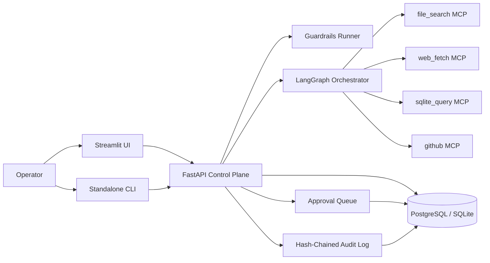

# AgentForge

[](https://github.com/Mehulupase01/AgentForge-Multi-Tool-Agent-with-MCP--NeMo-Guardrails---Audit-Logging/actions/workflows/ci.yml)
[](https://github.com/Mehulupase01/AgentForge-Multi-Tool-Agent-with-MCP--NeMo-Guardrails---Audit-Logging/actions/workflows/redteam.yml)
[](LICENSE)

Enterprise-safe agentic AI with MCP tool calling, deterministic guardrails, human approvals, and tamper-evident audit logging.

## Abstract

AgentForge is a production-structured multi-tool agent platform. It is designed to answer useful real-world tasks while still being reviewable by operators, stoppable by policy, and explainable after the fact. Instead of wiring tools directly into one opaque agent loop, AgentForge separates orchestration, safety, approvals, tool execution, and audit into explicit components.

## Layman-Friendly Introduction

Most AI agent demos look impressive until you ask a simple operational question:

- What tool did it call?
- Why was that tool allowed?
- Did it expose sensitive information?
- Could a human stop it before it did something risky?
- If something went wrong, is there a trustworthy audit trail?

AgentForge is built to answer those questions cleanly.

The system accepts a task through a FastAPI control plane, plans work with an LLM, executes tools through MCP sidecars, runs deterministic guardrails around both the input and the output, pauses medium and high-risk actions for approval, and records each important event into an append-only SHA-256 hash chain. Operators can inspect and drive the system through an HTTP API, a Streamlit UI, or a standalone CLI.

## System Overview

### Architecture



### Major Components

- `apps/api`: FastAPI control plane, task APIs, SSE streaming, persistence, approvals, audit, red-team runner.
- `apps/mcp_servers/file_search`: deterministic corpus search and document reads.
- `apps/mcp_servers/web_fetch`: allowlisted web fetch plus small curated fetch utilities.
- `apps/mcp_servers/sqlite_query`: read-only querying against the synthetic SQLite fixture DB.
- `apps/mcp_servers/github`: read-only GitHub API access through a scoped token.
- `apps/ui`: Streamlit operator interface.
- `apps/cli`: standalone command-line client.

### Safety Model

- Input guardrails can reject unsafe tasks before orchestration starts.
- Tool execution is deny-by-default outside the configured allowlist.
- Risky actions pause in `awaiting_approval` until a human decides.
- Output redaction removes detected PII before the final response is returned.
- Audit records are append-only in application code and integrity-checkable through the API.

## Verified Behavior

- FastAPI control plane, audit APIs, approvals, red-team APIs, and MCP inspection APIs are implemented and covered by pytest.
- The adversarial red-team suite passed `50/50` locally on the maintained host path, producing `100.00%` compliance.
- The standalone CLI can create sessions, stream task events, approve actions, and verify audit integrity.
- The Streamlit UI imports cleanly and serves successfully in headless mode against the host verification harness.
- GitHub Actions workflows and full-stack Compose definitions are included for release use.

Docker-specific verification was explicitly waived on the maintainer's Windows host because the local Docker Desktop and Bitdefender environment is currently broken. All non-Docker Phase 10 verification in this repository is host-side.

## 60-Second Quickstart

```powershell
copy .env.example .env
# Fill in OPENROUTER_API_KEY and GITHUB_TOKEN

uv sync --directory apps/api
uv run --directory apps/api alembic upgrade head
uv run --directory apps/api python -m agentforge.tools.generate_corpus
uv run --directory apps/api agentforge seed-synthetic --output fixtures/synthetic.sqlite
uv run --directory apps/api agentforge ingest-corpus
uv run --directory apps/api pytest -v
```

### Run The API

```powershell
uv run --directory apps/api uvicorn agentforge.main:app --app-dir src --host 0.0.0.0 --port 8015
```

### Operator Commands

```powershell
uv run --directory apps/cli agentforge session new
uv run --directory apps/cli agentforge task run "Find transformer content and summarize it."
uv run --directory apps/cli agentforge approval list
uv run --directory apps/cli agentforge audit verify
uv run --directory apps/api agentforge redteam-run
```

## Validation

Locally verified on the maintained host path:

- API health, session, audit, corpus, orchestrator, guardrail, approval, and SSE test suites
- All four MCP sidecar unit suites
- Streamlit import and headless boot smoke
- CLI operator flow against a mock-backed host API harness
- Red-team persistence, scoring, and JUnit report generation

Key verified outcomes:

- audit chain integrity verification works
- unsafe prompts are blocked and audited
- risky tool calls pause for approval and resume from persisted checkpoints
- the red-team threshold is enforced in code and CI workflow wiring
- the GitHub redteam workflow runs the deterministic safety suite by default and automatically adds the live OpenRouter gate when the repository secret `OPENROUTER_API_KEY` is configured

## Deployment

- Full stack Compose file: [ops/docker/compose.full.yml](ops/docker/compose.full.yml)
- Root shortcut: [docker-compose.yml](docker-compose.yml)
- Deployment notes: [docs/deployment.md](docs/deployment.md)

Production deployment should add real auth, TLS, secret management, persistent Postgres backups, centralized logs, and monitored CI gates. The repo ships the structure for that release path, but the local workstation used for development did not support Docker verification at the time of the final release pass.

## Development Notes

- OpenRouter is the primary live-model path in this repo, with `openrouter/free` as the default model selection.
- The GitHub MCP sidecar is intentionally read-only.
- `BLUEPRINT.md` and `BLUEPRINT.pdf` remain local-only by user instruction and are not tracked in Git.
- The Windows host used for development has port `8000` occupied by an unrelated local service, so host verification commonly used nearby ports such as `8010` through `8015`.

## Copy-Paste Resume State

- Phase 1 through Phase 10 are implemented sequentially in this repository.
- Docker verification is waived on the current Windows host by explicit maintainer instruction.
- OpenRouter is the configured live-model path.
- The repo memory files in `CLAUDE.md` and `docs/` describe the exact verified state and known local waivers.

## References

- Architecture summary: [docs/architecture.md](docs/architecture.md)
- Deployment guide: [docs/deployment.md](docs/deployment.md)
- Agent capability contract: [AGENTS.md](AGENTS.md)
- Contributing guide: [CONTRIBUTING.md](CONTRIBUTING.md)
- Changelog: [CHANGELOG.md](CHANGELOG.md)
