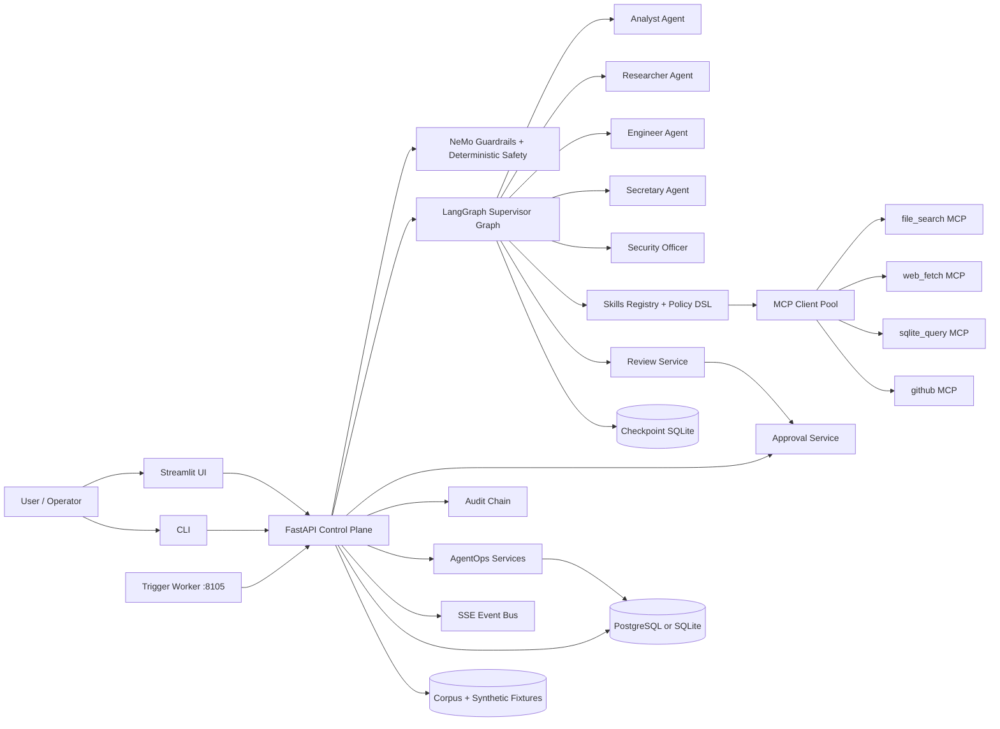
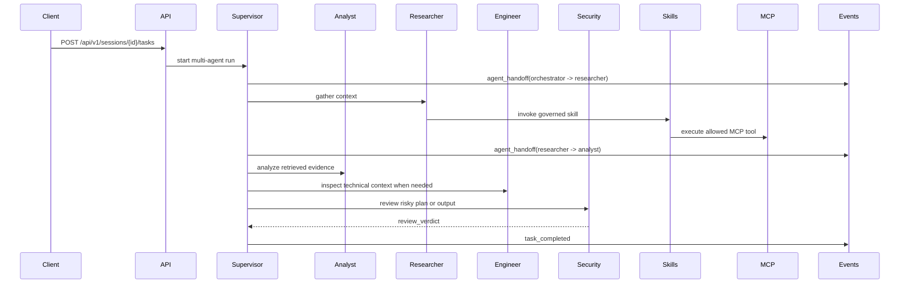
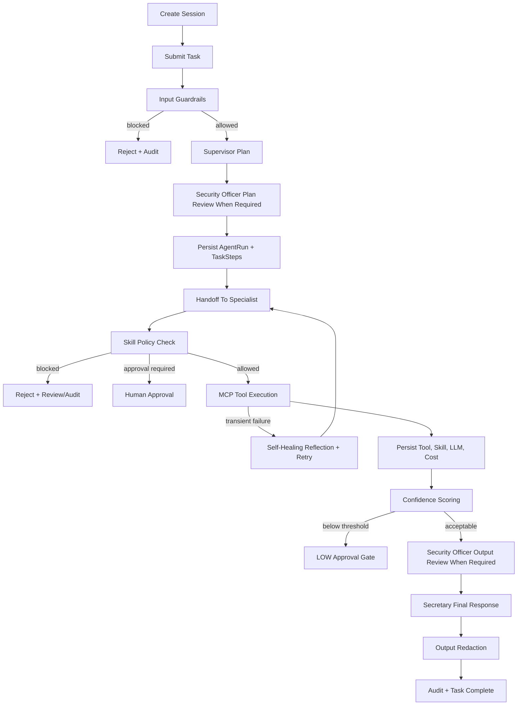
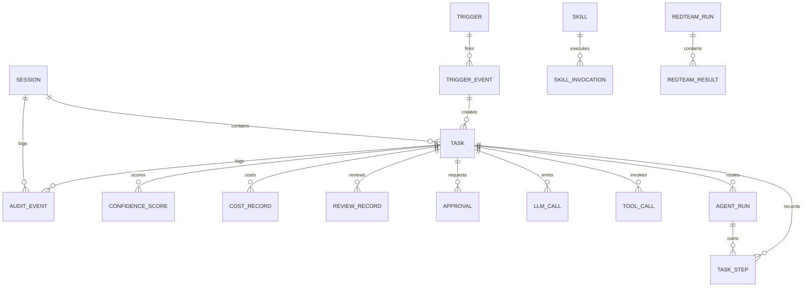
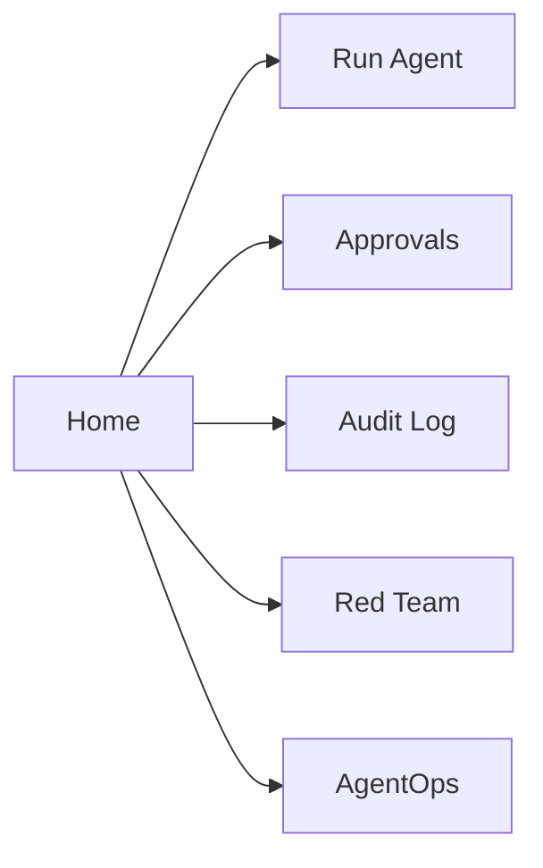

# AgentForge v2

### Multi-Agent Orchestration Platform with LangGraph Supervisor Graphs, MCP Tools, NeMo Guardrails, Replay, Skills, Triggers, AgentOps, and Tamper-Evident Audit Logging

[](https://github.com/Mehulupase01/AgentForge-Multi-Tool-Agent-with-MCP--NeMo-Guardrails---Audit-Logging/actions/workflows/ci.yml?query=branch%3AMulti-Agent-Orchestration)
[](https://github.com/Mehulupase01/AgentForge-Multi-Tool-Agent-with-MCP--NeMo-Guardrails---Audit-Logging/actions/workflows/redteam.yml?query=branch%3AMulti-Agent-Orchestration)
[](https://github.com/Mehulupase01/AgentForge-Multi-Tool-Agent-with-MCP--NeMo-Guardrails---Audit-Logging/tree/Multi-Agent-Orchestration)
[](https://www.python.org/)
[](https://fastapi.tiangolo.com/)
[](https://langchain-ai.github.io/langgraph/)
[](https://modelcontextprotocol.io/)
[](https://github.com/NVIDIA/NeMo-Guardrails)
[](https://streamlit.io/)
[](https://openrouter.ai/)
[](LICENSE)

AgentForge v2 turns the original AgentForge control plane into a supervised multi-agent runtime. It keeps the v1 foundation of MCP tools, NeMo Guardrails, human approval, red-team evaluation, and tamper-evident audit logging, then adds specialist agents, self-healing retries, deterministic replay, governed skills, Security Officer review, proactive triggers, and AgentOps telemetry.

This branch is not a chatbot demo. It is a production-structured agent platform designed to answer the operational questions that matter when agents can touch real systems:

- Which agent role handled each step?
- Why did the supervisor hand work to a specialist?
- Which skill policy constrained a tool call?
- Was a risky plan reviewed before execution?
- Can an interrupted task replay without duplicating completed work?
- What did the run cost, and how confident was the final result?
- Can the audit trail prove what happened after the fact?

---

## Table of Contents

- [Short Abstract](#short-abstract)
- [Branch Context](#branch-context)
- [Platform Snapshot](#platform-snapshot)
- [V2 Capability Map](#v2-capability-map)
- [System Architecture](#system-architecture)
- [Multi-Agent Runtime](#multi-agent-runtime)
- [Request Lifecycle](#request-lifecycle)
- [Safety and Control Model](#safety-and-control-model)
- [Skills Framework](#skills-framework)
- [Replay and Self-Healing](#replay-and-self-healing)
- [Triggers and Webhooks](#triggers-and-webhooks)
- [AgentOps Observability](#agentops-observability)
- [Persisted Data Model](#persisted-data-model)
- [Public Interfaces](#public-interfaces)
- [API Examples](#api-examples)
- [Operator Surfaces](#operator-surfaces)
- [Evaluation and Verification](#evaluation-and-verification)
- [Detailed Local Run Guide](#detailed-local-run-guide)
- [Repository Layout](#repository-layout)
- [Deployment Notes](#deployment-notes)
- [Known Local Waivers](#known-local-waivers)
- [References](#references)

---

## Short Abstract

AgentForge v2 is an agent control plane for supervised multi-agent execution. A user task enters through FastAPI, passes deterministic guardrails, receives a supervisor plan, and is routed across specialist LangGraph subgraphs. Tool access is mediated through MCP sidecars and governed by versioned YAML skills. Risky plans and actions can be reviewed by a Security Officer agent or paused for human approval. The runtime records audit events, task steps, reviews, skill invocations, cost records, confidence scores, and replay metadata so operators can inspect what happened later.

The system is deliberately explicit. It exposes HTTP APIs, a Streamlit operator UI, a CLI, readiness checks, red-team suites, database migrations, and CI jobs. The result is closer to an agent operations platform than a prompt wrapper.

---

## Branch Context

This README describes the `Multi-Agent-Orchestration` branch.

| Branch | Purpose | Relationship to `main` |
| --- | --- | --- |
| `main` | v1 multi-tool agent platform | FastAPI, LangGraph single orchestrator, MCP sidecars, guardrails, approvals, audit chain, Streamlit UI, CLI, redteam |
| `Multi-Agent-Orchestration` | v2 delta branch | Adds phases 11-18: supervisor graph, self-healing, replay, skills, Security Officer, triggers, AgentOps, and v2 release hardening |

The v2 branch preserves the v1 behavior where possible. The supervisor graph is additive, and the original orchestrator path remains available for compatibility-oriented flows and regression coverage.

---

## Platform Snapshot

| Area | What is included | Why it matters |
| --- | --- | --- |
| Control plane | FastAPI API, typed schemas, API-key auth, health/readiness endpoints | Gives the platform an explicit boundary that can be tested, automated, and operated |
| Multi-agent runtime | LangGraph supervisor graph with six roles and specialist subgraphs | Routes work to purpose-built agents instead of relying on one overloaded persona |
| Tool plane | Four MCP sidecars: `file_search`, `web_fetch`, `sqlite_query`, `github` | Keeps tool execution isolated, inspectable, and readiness-aware |
| Skills | Versioned YAML skills with a closed five-key policy schema | Makes specialist behavior packageable, reviewable, reloadable, and constrained by policy |
| Safety | NeMo Guardrails, prompt-injection checks, PII redaction, tool allowlist, Security Officer review | Turns agent safety into deterministic and auditable control points |
| Recovery | Self-healing retry decisions and replay with idempotency keys | Lets transient failures recover without duplicating completed work |
| Governance | Human approvals, review records, append-only SHA-256 audit chain | Supports investigation, compliance, and accountable operations |
| Proactivity | Webhook and scheduled triggers plus a trigger worker on port `8105` | Allows work to start from external events as well as manual prompts |
| AgentOps | Cost records, confidence scores, handoff analytics, Streamlit dashboard | Gives operators live visibility into cost, quality, and routing behavior |
| Evaluation | v1 and v2 red-team suites with CI safety gates | Keeps safety measurable as capability increases |

---

## V2 Capability Map

| Phase | Capability | Status | Main artifact areas |
| --- | --- | --- | --- |
| 11 | Agent roster and supervisor graph | Complete | `apps/api/src/agentforge/agents/`, `agent_runs`, agent routes |
| 12 | Self-healing and introspection | Complete | retry/reflection steps, retry audit events, `agent_retry` SSE |
| 13 | Durable checkpointing and replay | Complete | replay API, idempotency keys, replay CLI |
| 14 | Skills framework | Complete | `skills`, `skill_invocations`, YAML skills, policy enforcement |
| 15 | Agentic peer review | Complete | Security Officer review, `review_records`, review routes |
| 16 | Proactive triggers and webhooks | Complete | `triggers`, `trigger_events`, `apps/trigger_worker` |
| 17 | AgentOps dashboard, confidence, and cost | Complete | `cost_records`, `confidence_scores`, observability routes, AgentOps UI |
| 18 | v2 hardening and release | Complete | v2 docs, workflows, red-team suites, compose/env updates |

---

## System Architecture



### Runtime components

| Component | Role |
| --- | --- |
| `apps/api` | Main control plane for sessions, tasks, agents, skills, approvals, reviews, replay, triggers, audit, observability, and red-team runs |
| `apps/api/src/agentforge/agents` | Supervisor graph, specialist definitions, routing logic, role capabilities, and multi-agent execution helpers |
| `apps/mcp_servers/file_search` | MCP sidecar for local markdown corpus search and document reads |
| `apps/mcp_servers/web_fetch` | MCP sidecar for controlled web retrieval |
| `apps/mcp_servers/sqlite_query` | MCP sidecar for read-only queries against the synthetic SQLite fixture |
| `apps/mcp_servers/github` | MCP sidecar for scoped GitHub lookups |
| `apps/trigger_worker` | APScheduler-backed worker service that fires enabled triggers into the API |
| `apps/ui` | Streamlit operator UI, including the v2 AgentOps dashboard |
| `apps/cli` | Command-line operator client for sessions, tasks, approvals, audit, redteam, and replay |

---

## Multi-Agent Runtime

The v2 runtime introduces a supervisor graph with six explicit roles.

| Agent role | Primary purpose | Typical capabilities |
| --- | --- | --- |
| `orchestrator` | Owns task decomposition, routing, and final synthesis | Builds the supervisor plan and coordinates specialist handoffs |
| `analyst` | Turns data and tool results into structured analysis | Summarization, comparison, scoring, reasoning over retrieved context |
| `researcher` | Finds and reads information | Corpus search, controlled web fetch, source-oriented synthesis |
| `engineer` | Handles technical and repository-oriented work | SQLite inspection, GitHub context lookup, implementation-oriented planning |
| `secretary` | Produces concise operator-facing summaries and handoff notes | Final response drafting, status summaries, operational notes |
| `security_officer` | Reviews risky plans, tool calls, and flagged outputs | Approve/reject review verdicts, rationale, escalation to human approvals |

### Supervisor handoff flow



### Event stream additions

The task SSE stream now includes v2 events alongside the v1 events:

| Event | Meaning |
| --- | --- |
| `agent_handoff` | Supervisor moved work from one agent role to another |
| `agent_retry` | A bounded self-healing retry was recorded |
| `review_verdict` | Security Officer produced a review decision |
| `skill_invoked` | A governed skill invocation was executed or evaluated |
| `cost_update` | Token/cost accounting changed for the task |
| `confidence_update` | Confidence scoring changed for the task |
| `task_replayed` | Replay skipped or recovered a completed step |

---

## Request Lifecycle



### Practical flow

1. A user creates or reuses a session.
2. A task is submitted through the API, UI, CLI, or a trigger.
3. Guardrails evaluate the prompt before orchestration.
4. The supervisor decomposes the task and chooses specialist roles.
5. Specialists invoke governed skills rather than raw tool access.
6. Tool calls pass through MCP sidecars after policy and risk checks.
7. Self-healing retries recover eligible transient failures.
8. Security Officer review gates risky plans, tool calls, and flagged outputs.
9. Cost and confidence are recorded.
10. Low-confidence work can create a human approval gate.
11. Final output is redacted, audited, and returned.

---

## Safety and Control Model

AgentForge v2 uses layered controls rather than one broad safety prompt.

| Layer | Control | Persistence / visibility |
| --- | --- | --- |
| Input | Guardrails, prompt-injection screening, blocked-request classification | audit events |
| Planning | Supervisor plan review for risky work | review records, SSE `review_verdict` |
| Agent scope | Role capabilities and specialist boundaries | agent run records and task steps |
| Skill policy | Closed five-key YAML policy schema | skill and skill invocation records |
| Tool execution | MCP allowlist, risk classifier, approval interrupts | tool calls, approvals, audit events |
| Output | PII redaction and flagged long-form review | review records and final response |
| Confidence | `0.6 * heuristic + 0.4 * self_reported` gate | confidence scores and LOW approvals |
| Audit | Append-only SHA-256 event chain | audit integrity endpoint |

The Security Officer is intentionally additive. It does not replace deterministic guardrails or human approval. It adds a second-line review path for plans, medium/high-risk tool calls, and outputs that need more scrutiny.

---

## Skills Framework

Skills are the v2 bridge between agent intent and governed execution.

Each skill is a versioned YAML file with top-level role, tool, and knowledge declarations plus a closed policy schema. The policy surface is intentionally small so it remains reviewable and enforceable:

| Policy key | Purpose |
| --- | --- |
| `max_results_per_call` | Truncates oversized list-style tool results |
| `forbid_fields` | Removes fields that a skill must not expose |
| `require_approval_if` | Declares conditions that require human approval before execution |
| `topic_scope` | Keeps a skill scoped to approved subject areas |
| `rate_limit` | Applies per-skill execution pacing |

Shipped skills cover the core operational patterns:

| Skill | Typical purpose |
| --- | --- |
| `corporate_research` | Research company, market, and corpus evidence through controlled file and web tools |
| `customer_support` | Draft customer-safe summaries and responses with consistent tone and escalation discipline |
| `repo_health` | Inspect repository health signals and open engineering work through GitHub tools |
| `workforce_analytics` | Answer workforce, project, and assignment questions from the synthetic corporate database |

Skill APIs:

- `GET /api/v1/skills`
- `GET /api/v1/skills/{skill_id}`
- `POST /api/v1/skills/reload`

---

## Replay and Self-Healing

### Self-healing

The self-healing layer records retry behavior as first-class task history. Eligible transient failures create reflection and retry task steps, publish an `agent_retry` SSE event, and either recover within bounds or escalate cleanly.

Self-healing is deterministic:

- transient errors can retry
- guardrail blocks do not retry
- validation failures escalate
- unknown exceptions fail safe
- retry attempts are bounded and linked to parent steps

### Replay

Replay is built for durable recovery, not duplicate execution. It derives deterministic idempotency keys for task steps and consults completed-step records before doing work again.

Replay behavior:

- completed read-only steps are skipped
- already-completed tasks are rejected as replay conflicts
- non-idempotent work is escalated rather than blindly repeated
- replay emits `task_replayed` stream events
- the CLI exposes `agentforge task-replay <task_id>`

Replay API:

- `POST /api/v1/tasks/{task_id}/replay`

---

## Triggers and Webhooks

The trigger system lets AgentForge create tasks from external events.

| Trigger feature | Description |
| --- | --- |
| Trigger CRUD | Create, list, inspect, update, and disable triggers |
| Webhook ingestion | Accept GitHub and generic webhook payloads |
| HMAC validation | Validate GitHub and generic signatures before accepting events |
| Internal fire endpoint | Lets the trigger worker fire scheduled triggers safely |
| Template rendering | Turns trigger payload data into task prompts |
| Trigger worker | APScheduler service on port `8105` |

Trigger APIs:

- `POST /api/v1/triggers`
- `GET /api/v1/triggers`
- `GET /api/v1/triggers/{trigger_id}`
- `PATCH /api/v1/triggers/{trigger_id}`
- `DELETE /api/v1/triggers/{trigger_id}`
- `GET /api/v1/triggers/{trigger_id}/events`
- `POST /api/v1/triggers/webhook/{source}`
- `POST /api/v1/triggers/internal/fire`

---

## AgentOps Observability

AgentOps turns the multi-agent runtime into something operators can inspect.

| Signal | How it is recorded | Where it is surfaced |
| --- | --- | --- |
| Cost | `cost_records` | observability APIs and Streamlit AgentOps page |
| Confidence | `confidence_scores` | confidence API, task response, confidence gauge |
| Handoffs | `agent_runs` parent/child relationships | handoff API and sankey chart |
| Low confidence | automatic LOW approval | approvals API and operator UI |

Confidence uses the blueprint formula exactly:

```text
confidence = 0.6 * heuristic + 0.4 * self_reported
```

OpenRouter free-model accounting is represented in the price table as `openrouter/free` with zero USD cost so the default free path is tracked honestly instead of being omitted.

Observability APIs:

- `GET /api/v1/observability/tasks/{task_id}/cost`
- `GET /api/v1/observability/tasks/{task_id}/confidence`
- `GET /api/v1/observability/summary`
- `GET /api/v1/observability/agent_handoffs`

---

## Persisted Data Model

The v2 branch expands the v1 data model with multi-agent, skills, review, trigger, and observability records.



| Model | Purpose |
| --- | --- |
| `Session` | Top-level conversation or execution container |
| `Task` | Individual user, trigger, or replayed work item |
| `TaskStep` | Step-by-step execution trail, including v2 role/attempt/replay metadata |
| `AgentRun` | Specialist run record with role, status, parent linkage, and capabilities context |
| `ToolCall` | MCP tool call inputs, outputs, and status |
| `LLMCall` | Model invocation metadata and token usage |
| `Skill` | Versioned YAML skill definition loaded into the registry |
| `SkillInvocation` | Skill execution record tied to task, agent, policy, and tool usage |
| `ReviewRecord` | Security Officer review verdicts and rationale |
| `Approval` | Human approval requests and decisions |
| `Trigger` | Webhook or scheduled trigger definition |
| `TriggerEvent` | Accepted, rejected, or fired trigger payload |
| `CostRecord` | Per-task LLM cost accounting |
| `ConfidenceScore` | Heuristic and self-reported confidence with merged score |
| `AuditEvent` | Append-only audit chain event |
| `CorpusDocument` | Ingested markdown corpus metadata |
| `RedteamRun` | Persisted safety evaluation run |
| `RedteamResult` | Per-scenario red-team result |

Migration ownership:

- `007_multi_agent.py`
- `008_skills.py`
- `009_reviews.py`
- `010_triggers.py`
- `011_observability.py`

---

## Public Interfaces

### API surface summary

| Domain | Primary endpoints | Typical operator outcome |
| --- | --- | --- |
| Health | `GET /api/v1/health/liveness`, `GET /api/v1/health/readiness` | Confirm API, DB, MCP sidecars, and worker readiness |
| Agents | `GET /api/v1/agents`, `GET /api/v1/agents/{role}/capabilities` | Inspect roster and role-scoped capabilities |
| Sessions | `POST /api/v1/sessions`, `GET /api/v1/sessions`, `GET /api/v1/sessions/{session_id}` | Create and inspect agent work containers |
| Tasks | `POST /api/v1/sessions/{session_id}/tasks`, `GET /api/v1/tasks/{task_id}`, `GET /api/v1/tasks/{task_id}/stream`, `POST /api/v1/tasks/{task_id}/resume`, `POST /api/v1/tasks/{task_id}/replay` | Start, watch, resume, and replay work |
| Task detail | `GET /api/v1/tasks/{task_id}/steps`, `GET /api/v1/tasks/{task_id}/agents`, `GET /api/v1/tasks/{task_id}/reviews` | Inspect execution, handoffs, and review history |
| Skills | `GET /api/v1/skills`, `GET /api/v1/skills/{skill_id}`, `POST /api/v1/skills/reload` | Inspect and reload governed skill definitions |
| Approvals | `GET /api/v1/approvals`, `GET /api/v1/approvals/{approval_id}`, `POST /api/v1/approvals/{approval_id}/decision` | Resolve risky or low-confidence work |
| Triggers | CRUD, webhook ingestion, internal fire, event listing | Create proactive task-starting workflows |
| Observability | cost, confidence, summary, handoff endpoints | Monitor cost, confidence, and multi-agent routing |
| Audit | events and integrity endpoints | Investigate behavior and verify tamper-evidence |
| MCP | server and tool metadata endpoints | Confirm tool plane readiness |
| Redteam | run/list/result endpoints | Evaluate v1 and v2 safety posture |

### Changed task response fields

v2 task responses include additional operational context when available:

- `trigger_event_id`
- `supervisor_plan`
- `agent_runs`
- `reviews`
- `cost`
- `confidence`

---

## API Examples

The examples below are representative of the actual schema objects defined under `apps/api/src/agentforge/schemas/`.

### 1. Inspect the agent roster

```bash
curl http://localhost:8015/api/v1/agents \
  -H "X-API-Key: dev-key"
```

```json
{
  "agents": [
    {"role": "orchestrator", "display_name": "Orchestrator", "enabled": true},
    {"role": "analyst", "display_name": "Analyst", "enabled": true},
    {"role": "researcher", "display_name": "Researcher", "enabled": true},
    {"role": "engineer", "display_name": "Engineer", "enabled": true},
    {"role": "secretary", "display_name": "Secretary", "enabled": true},
    {"role": "security_officer", "display_name": "Security Officer", "enabled": true}
  ]
}
```

### 2. Submit a supervised task

```bash
curl -X POST http://localhost:8015/api/v1/sessions/7c1b9d8c-3b32-4d2d-8d84-a5d70228f0fb/tasks \
  -H "Content-Type: application/json" \
  -H "X-API-Key: dev-key" \
  -d '{
    "user_prompt": "Research the corpus, inspect relevant repository context, and produce a concise implementation plan.",
    "supervisor_plan": true
  }'
```

```json
{
  "id": "4bf22d77-3815-4e7f-9af2-763ec0286b75",
  "session_id": "7c1b9d8c-3b32-4d2d-8d84-a5d70228f0fb",
  "status": "queued",
  "trigger_event_id": null,
  "supervisor_plan": true,
  "cost": null,
  "confidence": null
}
```

### 3. Watch v2 SSE events

```text
event: agent_handoff
data: {"from":"orchestrator","to":"researcher","reason":"Need corpus evidence"}

event: skill_invoked
data: {"skill_id":"corporate_research","version":"1.0.0","status":"completed"}

event: review_verdict
data: {"reviewer_role":"security_officer","verdict":"approved","rationale":"Plan is bounded and read-only"}

event: cost_update
data: {"model":"openrouter/free","usd_cost":0.0,"prompt_tokens":590,"completion_tokens":220}

event: confidence_update
data: {"value":0.86,"heuristic_value":0.9,"self_reported_value":0.8}
```

### 4. Replay an interrupted task

```bash
curl -X POST http://localhost:8015/api/v1/tasks/4bf22d77-3815-4e7f-9af2-763ec0286b75/replay \
  -H "X-API-Key: dev-key"
```

```json
{
  "task_id": "4bf22d77-3815-4e7f-9af2-763ec0286b75",
  "status": "accepted",
  "skipped_steps": 3,
  "message": "Replay accepted; completed idempotent steps will be reused."
}
```

### 5. Create a generic webhook trigger

```bash
curl -X POST http://localhost:8015/api/v1/triggers \
  -H "Content-Type: application/json" \
  -H "X-API-Key: dev-key" \
  -d '{
    "name": "Nightly audit summary",
    "source": "generic",
    "kind": "webhook",
    "enabled": true,
    "prompt_template": "Summarize event {{event_type}} for {{repository}} and identify security review points.",
    "config": {"secret": "local-dev-secret"}
  }'
```

### 6. Inspect task confidence

```bash
curl http://localhost:8015/api/v1/observability/tasks/4bf22d77-3815-4e7f-9af2-763ec0286b75/confidence \
  -H "X-API-Key: dev-key"
```

```json
{
  "task_id": "4bf22d77-3815-4e7f-9af2-763ec0286b75",
  "latest": {
    "score": 0.86,
    "heuristic_value": 0.9,
    "self_reported_value": 0.8,
    "threshold": 0.8,
    "approval_required": false
  }
}
```

---

## Operator Surfaces

### CLI

The Streamlit companion CLI in `apps/cli` supports the core operator flow:

- `agentforge session new`
- `agentforge task run "<prompt>"`
- `agentforge approval list`
- `agentforge approval approve <approval_id>`
- `agentforge audit verify`

The API package also exposes maintenance commands:

- `agentforge seed-synthetic`
- `agentforge ingest-corpus`
- `agentforge task-replay <task_id>`
- `agentforge redteam-run`
- `agentforge redteam-run --suite v2`

### Streamlit UI

The Streamlit app is organized around operational work rather than marketing screens.

| Page | Purpose |
| --- | --- |
| Home | Readiness snapshot and recent session visibility |
| Run Agent | Submit tasks, stream events, inspect final responses |
| Approvals | Review and resolve human approval gates |
| Audit Log | Browse audit events and verify integrity |
| Red Team | Run and inspect safety evaluations |
| AgentOps | View cost trends, confidence gauge, and agent handoff sankey |

### UI navigation map



The UI does not own a separate business logic layer. It calls the same HTTP API used by the CLI and external clients.

---

## Evaluation and Verification

The v2 branch was implemented phase by phase and verified locally with the Docker waiver noted below.

| Verification area | Expected coverage |
| --- | --- |
| v1 regression suite | Existing API, guardrails, approvals, audit, MCP, redteam, UI import coverage |
| v2 API suite | supervisor graph, self-healing, replay, skills, reviews, triggers, observability |
| Trigger worker | worker health, API client behavior, schedule fire path |
| Redteam v1 | original safety scenarios with high threshold |
| Redteam v2 | 20 additional scenarios across multi-agent categories |
| CI | `test-v2`, trigger worker build, sidecar build checks, split redteam jobs |

Local branch closure evidence from the v2 release pass:

- `uv run --directory apps/api pytest -q` -> `96 passed`
- `uv run --directory apps/trigger_worker pytest -q` -> `2 passed`
- AgentOps Streamlit import smoke passed
- Alembic upgraded through v2 head

The v2 red-team suite covers these added categories:

- multi-agent handoff abuse
- Security Officer bypass
- skill policy bypass
- trigger spoofing
- confidence attack
- tool abuse
- goal hijack

---

## Detailed Local Run Guide

### 1. Create local environment

```powershell
copy .env.example .env
```

Fill in local-only values:

```env
API_KEY=dev-key
OPENROUTER_API_KEY=your_key_here
OPENROUTER_MODEL=openrouter/free
GITHUB_TOKEN=your_scoped_token_here
GENERIC_WEBHOOK_SECRET=local-dev-secret
TRIGGER_WORKER_INTERNAL_API_KEY=dev-key
CONFIDENCE_GATE_THRESHOLD=0.80
OPENAI_PRICES_PATH=fixtures/pricing/openrouter_prices.yml
```

### 2. Sync the workspace

```powershell
uv sync --directory apps/api
uv sync --directory apps/cli
uv sync --directory apps/ui
uv sync --directory apps/trigger_worker
```

Install the spaCy model used by the guardrail suites:

```powershell
uv pip install --python .venv\Scripts\python.exe https://github.com/explosion/spacy-models/releases/download/en_core_web_sm-3.7.1/en_core_web_sm-3.7.1-py3-none-any.whl
```

### 3. Initialize the database

```powershell
uv run --directory apps/api alembic upgrade head
```

### 4. Generate and ingest local fixtures

```powershell
uv run --directory apps/api python -m agentforge.tools.generate_corpus
uv run --directory apps/api agentforge seed-synthetic --output fixtures/synthetic.sqlite
uv run --directory apps/api agentforge ingest-corpus
```

### 5. Run verification

```powershell
uv run --directory apps/api pytest -q
uv run --directory apps/trigger_worker pytest -q
uv run --directory apps/api pytest tests/safety/test_redteam_suite.py tests/safety/test_redteam_v2.py -q
```

### 6. Start the API

```powershell
uv run --directory apps/api uvicorn agentforge.main:app --app-dir src --host 0.0.0.0 --port 8015
```

### 7. Start the trigger worker

```powershell
uv run --directory apps/trigger_worker uvicorn trigger_worker.server:app --app-dir src --host 0.0.0.0 --port 8105
```

### 8. Start the UI

```powershell
uv run --directory apps/ui streamlit run src/agentforge_ui/app.py
```

### 9. Use the CLI

```powershell
uv run --directory apps/cli agentforge session new
uv run --directory apps/cli agentforge task run "Research corpus guidance, inspect repo context, and summarize the security review points."
uv run --directory apps/cli agentforge approval list
uv run --directory apps/cli agentforge audit verify
uv run --directory apps/api agentforge task-replay <task_id>
```

---

## Repository Layout

```text
apps/
  api/
    alembic/
      versions/
        007_multi_agent.py
        008_skills.py
        009_reviews.py
        010_triggers.py
        011_observability.py
    src/agentforge/
      agents/
      guardrails/
      models/
      routers/
      schemas/
      services/
      skills/
      tools/
    tests/
  cli/
    src/agentforge_cli/
  trigger_worker/
    src/trigger_worker/
    tests/
  ui/
    src/agentforge_ui/
    tests/
  mcp_servers/
    file_search/
    web_fetch/
    sqlite_query/
    github/
fixtures/
  corpus/
  pricing/
ops/
  docker/
  github/
.github/
  workflows/
docker-compose.yml
pyproject.toml
uv.lock
```

### Workspace packages

- `agentforge-api`
- `agentforge-cli`
- `agentforge-ui`
- `agentforge-trigger-worker`
- `file-search-mcp`
- `web-fetch-mcp`
- `sqlite-query-mcp`
- `github-mcp`

---

## Deployment Notes

The repository includes compose definitions for the intended full stack, even though local Docker verification was waived on the maintainer workstation.

| Mode | Components | Best for | Notes |
| --- | --- | --- | --- |
| API-only local | API, local SQLite/checkpoints, optional local sidecars | Router, schema, and orchestration development | Lowest friction on Windows |
| Host full-stack | API, MCP sidecars, trigger worker, UI, CLI | End-to-end operator testing without containers | Sensitive to security software and local ports |
| Docker Compose | API, DB, MCP sidecars, trigger worker, UI | Repeatable release-like runs | Preferred when Docker Desktop is healthy |
| GitHub Actions | lint, tests, sidecar builds, worker build, redteam | Release confidence and regression prevention | Avoids local Docker/antivirus instability |
| Hardened production | managed DB, secret manager, TLS, stronger auth, observability | Real operator deployment | Requires environment-specific hardening beyond local dev defaults |

Production hardening should include:

- managed PostgreSQL with backups
- secrets outside `.env`
- TLS termination
- stronger auth than shared API keys
- protected branches with required CI and redteam checks
- centralized logs, metrics, and alerting
- token rotation for GitHub and OpenRouter credentials

---

## Known Local Waivers

Docker verification was explicitly waived on the maintainer's Windows workstation because Docker Desktop and Bitdefender interfered with container execution. The compose files are still part of the shipped architecture; the waiver applies only to local verification on that machine.

Local host-side verification and GitHub Actions are the preferred evidence sources for this branch.

---

## References

- [FastAPI](https://fastapi.tiangolo.com/)
- [LangGraph](https://langchain-ai.github.io/langgraph/)
- [Model Context Protocol](https://modelcontextprotocol.io/)
- [NVIDIA NeMo Guardrails](https://github.com/NVIDIA/NeMo-Guardrails)
- [Streamlit](https://streamlit.io/)
- [OpenRouter](https://openrouter.ai/)
- [APScheduler](https://apscheduler.readthedocs.io/)
- [GitHub Actions](https://docs.github.com/actions)
- [License](LICENSE)
